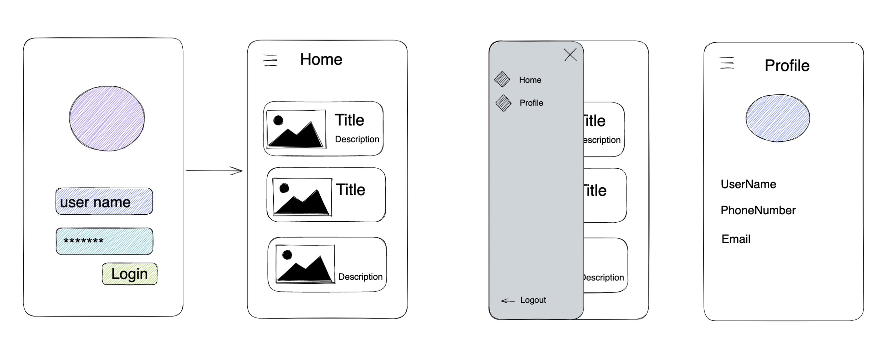

# react-native-training



We are going to build an app called "iPet". This is a social application for your pets.

## Prerequisites
- [Environment Setup](https://reactnative.dev/docs/next/environment-setup)
- We will develop a React Native app using version 0.68.0. You must install Ruby version 2.7.4 and set it as global used to make sure the React Native app  will be working on iOS. 

## Instructions
### Creating new application
- We will start a new project using version 0.68.0, running the following command:
```sh
npx react-native init iPet --version 0.68.0
```
Don't worry if you are having a trouble with iOS try to reinstall the dependencies by running:
```sh
cd ios 
bundle install
bundle exec pod install
```

- Start Metro
```sh
npx react-native start
```

- Run app in the iOS Simulator 
```sh 
npx react-native run-ios 
```
or Run app in the Android Emulator
```sh
npx react-native run-android
```

### Creating Login Page 
### Creating Home Page 
### Creating Profile Page
### Setup Navigation
- [] Setup React Navigation
- [] Authentication flow
- [] Setup Drawer

## Troubleshooting
### Your Ruby version is 2.6.8, but your Gemfile specified 2.7.5
- https://stackoverflow.com/questions/74189532/your-ruby-version-is-2-6-8-but-your-gemfile-specified-2-7-5
